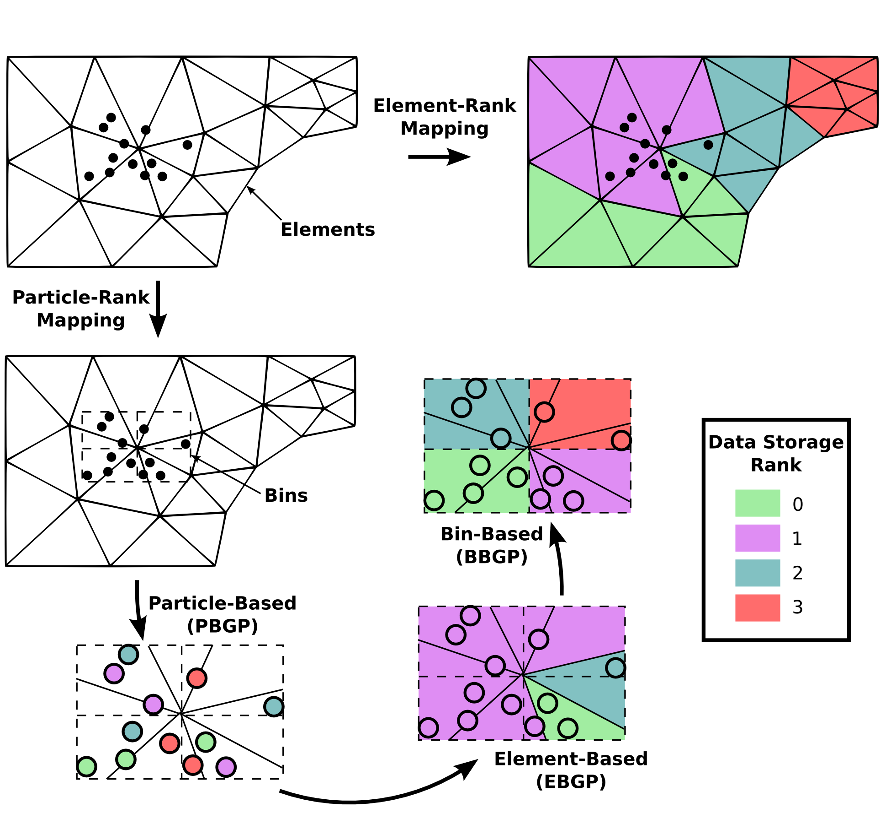

.. _overlap-mesh:

------------
Overlap Mesh
------------

Mapping
^^^^^^^
In particle-in-cell simulations, the particles are often required to interact with an Eulerian mesh. Since the particle are tracked individually at discrete locations that do not necessarily coincide with a mesh, interactions between the particles and mesh must be handled carefully. We define two key opperations between the particles and the mesh:

1. Interpolation - field quantities on the mesh are evaulated at the particle's coordinates,
2. Projection - particle quantities are filtered from the particle's coordinates to the mesh.

Both of these operations require the user to initially specify the coordinates of the mesh. In the current version of ppiclF, only element based hexahedral (or quad in 2D) meshes are supported.

The elements of the mesh are stored in memory according to the external program which calls ppiclF. For this reason, the elements need to be mapped to bins where the particles are stored. An example of this mapping is shown in the figure below.

   Illustration of mapping overlapping mesh to bins.

In the top left corner of the figure, a semicircular mesh is given. Particles handled by ppiclF are shown in the interior of the mesh. The four bins generated through the algorithm in the section :ref:`part-storage` are also shown surrounding the particles. The particles within the same bin are mapped to the same processor as illustrated in through the coloring of bins in the bottom left corner of the figure. 

The elements in the mesh are mapped to processing ranks in the top right of the figure. Note that the ppiclF library is independent of this mesh-to-rank mapping and this is handled in the external calling program. As is shown in the bottom right corner of the figure, the mesh elements which are spatially found within each bin belong to processing ranks that are not the same as the ranks which store the bin data. For this reason, the mesh and corresponding fields found within bins must be communicated between the processors that store the bins themselves. In this example, this results in:

* communication between rank 0 (bin 0) and ranks 0, 1, and 3,
* communication between rank 1 (bin 1) and ranks 0, 2, and 3,
* communication between rank 2 (bin 2) and ranks 0 and 1, 
* communication between rank 3 (bin 3) and ranks 0 and 2.

Interpolation
^^^^^^^^^^^^^
In order to interpolate fields from the mesh to the particle locations, the mesh coordinates and interpolated fields found within a bin are communicated to the processor which stores that bins data. Then, interpolation is performed locally.

The current supported interpolation method is element based, in that only the nodes of the mesh element which surround the particle is within is used to interpolate a field to the particle's position. In most cases, this results in trilinear (or bilinear in 2D) interpolation being performed. However, spectral polynomial interpolation is also supported in which mapped Gauss-Lobatto-Legendre points within each element are used to evaluate the barycentric Lagrange polynomials at the particles coordinates.

.. _projection:

Projection
^^^^^^^^^^
In order to project quantities from the particle locations to the mesh, each bin stores a copy of the mesh coordinates that are found within each bin. Then, particles are filtered to this mesh copy locally and then communicated back to the processing ranks in the original mesh-to-rank mapping.

The projection opperation is simply a filtering opperation which is characterized by a kernel. The current supported projection kernels are the box and Gaussian kernels. The projection opperation is performed for every i particle quantity :math:`A^{(i)}`, resulting in the projected field :math:`a(\mathbf{x})`. In this case, :math:`\mathbf{x}` correspond to the mesh coordinates and :math:`\mathbf{X}^{(i)}` is the i particle's coordinates. Projection for all :math:`N_p` particles is then computed by

.. math::
   a(\mathbf{x}) = \sum_{i=1}^{N_p} A^{(i)} g_{\mathcal{M}}(|\mathbf{x} - \mathbf{X}^{(i)}|).

Here, :math:`g_{\mathcal{M}}(r)` is the projection kernel. For the Gaussian kernel, we have

.. math::
     g_{\mathcal{M}}(r) = \left(\sqrt{\pi}\sqrt{\delta_f^2/(4 \ln 2)}\right)^{-d} \exp \left(\dfrac{-r^2}{\delta_f^2/(4 \ln 2)}\right),

where the kernel is parameterized by the filter half-width :math:`\delta_f` in :math:`d` dimensions. Note that when :math:`r = \delta_f/2`, the kernel has decayed to half of its :math:`r = 0` value.

The box kernel on the other hand is

.. math::
   g_{\mathcal{M}}(r) = \left\{\begin{array}{lr} \dfrac{1}{(4/3)^{d-2} \pi (\delta_f/2)^d}, & r \leq \delta_f/2 \\ 0, & r > \delta_f/2 \end{array} \right.

Similarly, the filter half-width defines the maximum point where distances :math:`r > \delta_f/2` are outside the filtering region. Note that due to the normalization of each filter, when the field :math:`a(\mathbf{x})` is integrated over the entire volume :math:`\mathcal{V}` (or area in 2D) spanned by the mesh, the following relationship is preserved

.. math::
   \int_{\mathcal{V}} a(\mathbf{x}) d\mathcal{V} = \sum_{i=1}^{N_p} A^{(i)}.

