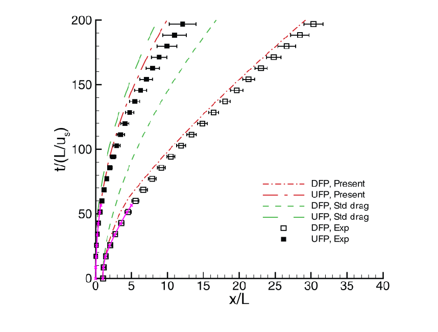

.. _CMT-nek_example:

--------------------------------------------------------------------------------
`CMT-nek Case <https://github.com/dpzwick/ppiclF/tree/master/examples/CMT-nek>`_
--------------------------------------------------------------------------------

.. raw:: html

    

        <iframe width="560" height="315" src="https://www.youtube.com/embed/JxWYpAv1CsM" frameborder="0" allow="accelerometer; autoplay; encrypted-media; gyroscope; picture-in-picture" allowfullscreen></iframe>
    

Background
^^^^^^^^^^
This is an example that illustrates a two-dimensional multiphase shock tube. This example also illustrates linking ppiclF to the compressible Discontinuous Galerkin solver CMT-nek_.

.. _CMT-nek: https://github.com/dpzwick/Nek5000/tree/jason

The core particle equations being solved in this case are

.. math::
   \dfrac{d \mathbf{X}}{d t} &= \mathbf{V}, \\ M_p \dfrac{d \mathbf{V}}{d t} &= \mathbf{F}_{qs} + \mathbf{F}_{pg} + \mathbf{F}_{am} + \mathbf{F}_{c}, \\ C_{p} M_p \dfrac{d T}{d t} &= Q_{qs}

where, for each particle we have the position vector :math:`\mathbf{X}`, the velocity vector :math:`\mathbf{V}`, the particle temperature :math:`T`, the particle mass :math:`M_p`, the particle specific heat :math:`C_p`, the viscous drag force :math:`\mathbf{F}_{qs}`, the pressure gradient force :math:`\mathbf{F}_{pg}`, the added-mass force :math:`\mathbf{F}_{am}`, the collision force :math:`\mathbf{F}_{c}`, and the quasi-steady heat transfer :math:`Q_{qs}`. The position and velocity vectors are given by

.. math::
   \mathbf{X} = \begin{bmatrix}X \\ Y \end{bmatrix},\quad \mathbf{V} = \begin{bmatrix}V_x \\ V_y \end{bmatrix}.

The collision force in the same as in the :ref:`dem3d` example. The drag force is complicated so it is not detailed here. It is given by the model found in `Parmar et al. (2010) <https://doi.org/10.2514/1.J050161>`_.

The pressure gradient force is given by

.. math::
   \mathbf{F}_{pg} = - V_p \nabla p

where :math:`V_p` is the particle volume and :math:`p` is the fluid pressure at each particle's position. The added-mass force is given by

.. math::
   \mathbf{F}_{am} = V_p C_M \left( -\nabla p - \dfrac{ d (\rho_f \mathbf{V})}{d t} \right)

where :math:`C_M` is an added mass coefficient given by the Mach number corrections of `Parmar et al. (2008) <https://doi.org/10.1098/rsta.2008.0027>`_ and the volume fraction corrections of `Zuber (1964) <https://doi.org/10.1016/0009-2509(64)85067-3>`_. For simplicity, we assume that the density of the fluid at each particle's location :math:`\rho_f` is relatively constant in time so that it can be pulled out of the time derivative.

The quasi-steady heat transfer is given by

.. math::
   Q_{qs} = 2 \pi \kappa D_p (T_f - T) \Phi_{qs}

where :math:`\kappa = C_{p,f}/Pr`, :math:`C_{p,f}` is the specific heat at constant pressure of the fluid at the particle's location, :math:`Pr` is the Prandtl number of the fluid at the particle's position, :math:`T_f` is the fluid temperature at the particle's position, and :math:`\Phi_{qs}` is a correction factor for the heat transfer that is a function of the particle Reynolds number and the Prandtl number.

With some manipulation, the final form of the particle equations which are being solved are

.. math::
   \dfrac{d \mathbf{X}}{d t} &= \mathbf{V}, \\ (C_M V_p \rho_f+ M_p) \dfrac{d \mathbf{V}}{d t} &= \mathbf{F}_{qs} - V_p (1 + C_M) \nabla p + \mathbf{F}_{c}, \\ C_{p} M_p \dfrac{d T}{d t} &= Q_{qs}

As a compressible fluid solver, CMT-nek without particles solves the Euler equations given by

.. math::
   \dfrac{\partial \rho_f}{\partial t} + \nabla \cdot (\rho_f \mathbf{u}) &= 0, \\ \dfrac{\partial (\rho_f \mathbf{u})}{\partial t} + \nabla \cdot (\rho_f \mathbf{u} \mathbf{u} + p \mathbf{I} ) &= 0, \\ \dfrac{\partial (\rho_f E)}{\partial t} + \nabla \cdot (\rho_f \mathbf{u} E + \mathbf{u} p) &= 0,

where :math:`\rho_f` is the fluid density, :math:`\mathbf{u}` is the fluid velocity, :math:`E` is the total energy of the fluid, and :math:`\mathbf{I}` is the identity tensor. 

Similarly, the governing multiphase equations are given by `Ling et al. (2016) <https://doi.org/10.1063/1.4942184>`_ and are

.. math::
   \dfrac{\partial (\phi_f \rho_f)}{\partial t} + \nabla \cdot (\rho_f \phi_f \mathbf{u}) &= 0, \\ \phi_f \rho_f \left( \dfrac{\partial \mathbf{u}}{\partial t} + \mathbf{u} \cdot \nabla \mathbf{u}\right) + \nabla p &= \mathbf{f}_{pf}, \\ \phi_f \rho_f \left( \dfrac{\partial E}{\partial t} + \mathbf{u} \cdot \nabla E \right) + \nabla \cdot ( \phi_f \mathbf{u} p + \phi_p \mathbf{v} p) &= g_{pf} + e_{pf}.

Here, :math:`\phi_f` is the fluid volume fraction, :math:`\mathbf{f}_{pf}` is the total hydrodynamic force from the particles on the fluid, :math:`g_{pf}` is the energy removed from the fluid by the work done by that force, and :math:`e_{pf}` is heat transfered directly from the particles to the fluid. Following a similar process as `Ling et al. (2016) <https://doi.org/10.1063/1.4942184>`_, these equations can be rearranged to yield

.. math::
   \dfrac{\partial \rho_f}{\partial t} + \nabla \cdot (\rho_f \mathbf{u}) =& \dfrac{A}{\phi_f}, \\ \dfrac{\partial (\rho_f \mathbf{u})}{\partial t} + \nabla \cdot (\rho_f \mathbf{u} \mathbf{u} + p \mathbf{I} ) =& \mathbf{u} \dfrac{A}{\phi_f} + \dfrac{\mathbf{f}_{pf}^*}{\phi_f}, \\ \dfrac{\partial (\rho_f E)}{\partial t} + \nabla \cdot (\rho_f \mathbf{u} E + \mathbf{u} p) =& \dfrac{E A}{\phi_f} - \dfrac{p}{\phi_f} \mathbf{u} \cdot \nabla \phi_f \\ &- \dfrac{p}{\phi_f} \nabla \cdot (\phi_p \mathbf{v}) + \dfrac{g_{pf}^*}{\phi_f} + \dfrac{e_{pf}}{\phi_f},

where the asterisk on the terms :math:`\mathbf{f}_{pf}^*` and :math:`g_{pf}^*` indicate that they pressure gradient force is no longer explicitly included in the hydrodynamic coupling as it is accounted for implicitly. Additionally, we have

.. math::
   A = - \rho_f \left( \dfrac{\partial \phi_f}{\partial t} + \mathbf{u} \cdot \nabla \phi_f \right).

Note in the present application, the term :math:`\partial \phi_f/\partial t` isn't included, but may be incorporated with minimal effort. In the above form, it is clear that the original CMT-nek solver can be used with minimal modification when including multiphase coupling from ppiclF, since every particle contribution can be included in the formulation through volumetric source terms only.

User Interface
^^^^^^^^^^^^^^
:ref:`hfile` for this case (`CMT-nek H-File <https://github.com/dpzwick/ppiclf/tree/master/examples/CMT-nek/user_routines/PPICLF_USER.h>`_) is given below and corresponds to the equations being solved and the property being stored for each particle. 

.. code-block:: c

   #define PPICLF_LPART 1500
   #define PPICLF_LRS 5
   #define PPICLF_LRP 12
   #define PPICLF_LEE 2700
   #define PPICLF_LEX 5
   #define PPICLF_LEY 5
   #define PPICLF_LRP_INT 8
   #define PPICLF_LRP_PRO 6
   
   #define PPICLF_JX 1
   #define PPICLF_JY 2
   #define PPICLF_JVX 3
   #define PPICLF_JVY 4
   #define PPICLF_JT 5
   
   #define PPICLF_R_JRHOP 1
   #define PPICLF_R_JRHOF 2
   #define PPICLF_R_JDP 3
   #define PPICLF_R_JVOLP 4
   #define PPICLF_R_JPHIP 5
   #define PPICLF_R_JUX 6
   #define PPICLF_R_JUY 7
   #define PPICLF_R_JDPDX 8
   #define PPICLF_R_JDPDY 9
   #define PPICLF_R_JCS 10
   #define PPICLF_R_JT 11
   #define PPICLF_R_JE 12
   
   #define PPICLF_P_JPHIP 1
   #define PPICLF_P_JFX 2
   #define PPICLF_P_JFY 3
   #define PPICLF_P_JPHIPU 4
   #define PPICLF_P_JPHIPV 5
   #define PPICLF_P_JE 6

The first block of lines denote the pre-defined directives. These directives are the maximum number of particles per processor, the number of equations, the number of properties, the sizes of the overlap mesh, the number of interpolated fields, and the number of projected fields.

The remaining blocks of lines indicate the index names of the particle variables being solved for, the property names for each particle, and the projected field names.

:ref:`ffile` for this case (`CMT-nek F-File <https://github.com/dpzwick/ppiclf/tree/master/examples/CMT-nek/user_routines/ppiclf_user.f>`_) has meaningful information in every routine. For this case, the routines are similar to those defined in the :ref:`Nek5000_example`. The routine ppiclf_user_SetYDot is more complicated due to the more involved force and heat transfer models described previously. Additionally, the routine ppiclf_user_MapProjPart includes six fields being projected, which are given in the table below:

.. table:: Projection mapping in ppiclf_user_MapProjPart.
   :align: center

   +------------------------------------------+-----------------------------------------------------------------------------------------+
   | Projected Field (:math:`a(\mathbf{x})`)  | Particle Property (:math:`A^{(i)}`)                                                     |
   +==========================================+=========================================================================================+
   | :math:`\phi_p`                           | :math:`V_p/D_p`                                                                         |
   +------------------------------------------+-----------------------------------------------------------------------------------------+
   | :math:`f_{pf,x}^*`                       | :math:`-(F_{qs,x}+F_{am,x})/D_p`                                                        |
   +------------------------------------------+-----------------------------------------------------------------------------------------+
   | :math:`f_{pf,y}^*`                       | :math:`-(F_{qs,y}+F_{am,y})/D_p`                                                        |
   +------------------------------------------+-----------------------------------------------------------------------------------------+
   | :math:`e_{pf} + g_{pf}^*`                | :math:`-(Q_{qs}+\mathbf{F}_{qs}\cdot\mathbf{V} + \mathbf{F}_{am}\cdot\mathbf{U}) /D_p`  |
   +------------------------------------------+-----------------------------------------------------------------------------------------+
   | :math:`\phi_{p} v_x`                     | :math:`V_p V_x/D_p`                                                                     |
   +------------------------------------------+-----------------------------------------------------------------------------------------+
   | :math:`\phi_{p} v_y`                     | :math:`V_p V_y/D_p`                                                                     |
   +------------------------------------------+-----------------------------------------------------------------------------------------+

As mentioned previously, the projected forces  are the added mass and the quasi-steady forces. Since in added mass force isn't directly computed in the final rearranged form of the particle equations, we save :math:`d \mathbf{V}/dt` before computing the new :math:`\dot{Y}` so that the entire added mass force may be computed. Additionally, the work done by the hydrodynamic forces and the heat transfer are stored in the same projected field. Similar to the :ref:`Nek5000_example`, the projected fields are normalized by :math:`D_p` in 2D. In 3D, this factor would not be included.

The :ref:`external` calls for this example occur within the user initialization Nek5000 routine usrdat2 in the file `mstube.usr <https://github.com/dpzwick/ppiclf/tree/master/examples/CMT-nek/mstube.usr>`_ with the minimum number of initialization and solve subroutines called. The majority of the solve routines are found in the routine cntchk, which is called every RK stage. The called ppiclF routines are nearly identical to the :ref:`Nek5000_example`, but with different initial conditions for the particle placement. Additionally, the extra volumetric source terms are computed in cmtchk and added as forcing in the routine userf.

Similar to :ref:`Nek5000_example`, ppiclF has been linked with Nek5000 in the Nek5000 makenek compilation file through the following lines:

.. code-block:: make

   SOURCE_ROOT_PPICLF=$HOME/libraries/ppiclF/source
   FFLAGS=" -I$SOURCE_ROOT_PPICLF"
   USR_LFLAGS+=" -L$SOURCE_ROOT_PPICLF -lppiclF"

Compiling and Running
^^^^^^^^^^^^^^^^^^^^^
This example can be tested with CMT-nek by issuing the following commands:

.. code-block:: bash

   cd ~
   git clone https://github.com/dpzwick/ppiclF.git           # clone ppiclF
   git clone -b jason https://github.com/dpzwick/Nek5000.git # clone CMT-nek
   mkdir TestCase                                            # make test directory
   cd TestCase
   cp -r ../ppiclF/examples/CMT-nek/* .                      # copy example files to test case
   cd ../ppiclF                                              # go to ppiclF code
   cp ../TestCase/user_routines/* source/                    # copy ppiclf_user.f and PPICLF_USER.h to source
   make                                                      # build ppiclF
   cd ../TestCase
   ./makenek mstube                                          # build CMT-nek and link with ppiclF
   echo mstube > SESSION.NAME && echo `pwd`/ >> SESSION.NAME # create CMT-nek necessary file
   mpirun -np 4 nek5000                                      # run case with 4 processors

Simulation Output
^^^^^^^^^^^^^^^^^
Previous work has been done with legacy codes and experiments for this setup. In this problem, a Mach 1.66 shock impacts a particle curtain of 2 mm at 20% volume fraction. Previous experiments and simulations (not ppiclF) can be found in `Ling et al. (2016) <https://doi.org/10.1063/1.4942184>`_. The upstream and downstream fronts of the particle curtain from ppiclF/CMT-nek can be compared to the legacy code and experiments. For ppiclF, the upstream and downstream fronts are taken by simply computing the maximum and minimum particle positions. The figure below shows a good comparison.

   Comparison of ppiclF/CMT-nek to previous experiments and a legacy code. ppiclF/CMT-nek is shown in the magenta curve. The background image is reproduced from Figure 14 from Ling, Y., et al. "Interaction of a planar shock wave with a dense particle curtain: Modeling and experiments." Physics of Fluids 24.11 (2012): 113301, with the permission of AIP Publishing.
